[Vol. 1 - Heads](https://github.com/openpunkart/punks.blocks) ·
[Vol. 2 - Bodies & More](https://github.com/openpunkart/punks.bodies) ·
[Vol. 3 - Black & White (1-Bit)](https://github.com/openpunkart/punks.black)

# Punk Building Block Series Vol. 3 - Black & White (1-Bit)

## Black & White (1-Bit) Punk Series (24×24)

_1-bit punks in black & white pixels_

Humans (u)

,
Alien (u)

,
Demon (u)

,
Frankenstein (u)

,
Orc (u)

,
Robot (u)

,
Vampire (u)

.

Attributes (by category and a-z):

- Hats -
  Bandana (u)          ,
  Beanie (u)           ,
  Cap (u)              ,
  Cap Forward (u)      ,
  Cowboy Hat (u)       ,
  Fedora (u)           ,
  Headband (u)         ,
  Knitted Cap (u)      ,
  Police Cap (u)       ,
  Sanata Hat (u)       ,
  Sun Hat (u)          ,
  Top Hat (u/f)         
- Hair -
  Crazy Hair (u)      ,
  Frumpy Hair (u)     ,
  Messy Hair (u)      ,
  Mohawk (u)          ,
  Peak Spike (u)      
- Eyes (Eyewear) -
  3D Glasses (u)       ,
  Regular Shades (u)   ,
  Small Shades (u)     ,
  VR (u)               
- Eyes -
  Alien Eyes (u)       ,
  Clown Eyes (u)       ,
  Eyes (u)             ,
  Heart Eyes (u)       ,
  Laser Eyes (u)       ,
  Orc Eyes (u)         ,
  Robot Eyes (u)       ,
  Scream Eyes (u)      ,
  Skeleton Eyes (u)    ,
  Zombie Eyes (u)      
- Nose -
  Ape Nose (u)         ,
  Clown Nose (u)       ,
  Nose (u)             ,
  Nose Small (u)       ,
  Nose Up (u)          ,
  Nose Up Big (u)      ,
  Orc Nose (u)         
- Ear -
  Earring (u)          
- Blemishes -
  Spots (u)            
- Mouth -
  Mouth (u)            ,
  Mouth Big (u)        ,
  Orc Mouth (u)        ,
  Orc Mouth Small (u)  ,
  Robot Mouth (u)      ,
  Scream Mouth (u)     ,
  Skeleton Mouth (u)   ,
  Vampire Mouth (u)    ,
  Vampire Mouth Small (u) ,
  Zombie Mouth (u)     
- Mouth (Emotion) -
  Frown (u)            ,
  Smile (u)            ,
  Smile Big (u)        
- Mouth Prop -
  Bubble Gum (u)       ,
  Cigrarette (u)       ,
  Medical Mask (u)     ,
  Pipe (u)             
- Misc -
  Ape Front (u)        
- Clothes -
  Bear Hood (u)        

## Black & White (1-Bit) Readymade 1/1s Punk Series Vol. 1 (24×24)

№1 to №150

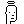
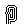

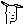

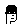

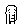

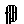
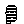

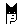

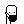

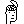
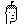

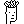

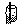

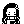

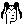

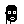

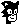

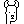

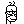
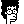
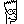
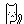
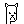

## Black & White (1-Bit) More Readymade 1/1s Punk Series Vol. 2 (24×24)

Moiré №151 & №152

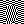

2x  4x 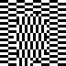 6x      
2x 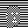 4x  6x 

## DIY (Do-It-Yourself) - Yes, You Can! Tips & Tricks To "Auto-Magically" Generate Your Own Black & White (1-Bit) Punks

### (Shadow Outline) Silhouette

Turn any "true color" punk into a black & white (1-bit)
"shadow outline" silhouette  (using [**Image#silhouette**](https://github.com/learnpixelart)).
Example - The First Ye Olde Matt & John's® Punks:

Before:

After:

### (Pencil Drawing) Sketch

Turn any "true color" punk into a black & white (1-bit)
"pencil drawing" sketch  (using [**Image#sketch**](https://github.com/learnpixelart)).
Example - The First Ye Olde Matt & John's® Punks:

Before:

After:

Note:  Using the `Image#sketch` special effect / algorithm will double the image size (e.g. 24×24 will become 49×49).

## Questions? Comments?

Post them over at the [Help & Support](https://github.com/geraldb/help) page. Thanks.
